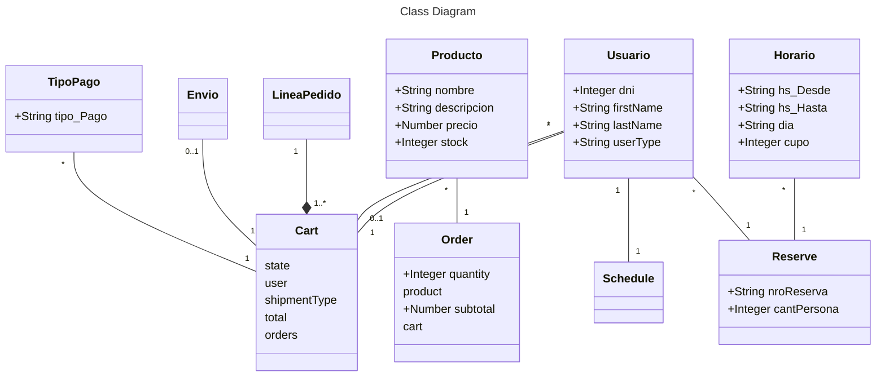

# Propuesta TP DSW

### Integrantes

| Legajo | Apellido y Nombres   |
| :----- | :------------------- |
| 48347  | Cantaberta Facundo   |
| 49641  | Battistoni Maria Paz |
| 48889  | Carballo Abril       |
| 47881  | Alfaro Bautista      |

### Repositorios

# BackEnd

- https://github.com/FacundoLpl/TP-Dsw

# FrontEnd

- https://github.com/FacundoLpl/FrontEnd-TPdsw

## Tema

### Descripción

Para el trabajo decidimos realizar un sistema relacionado con el sector gastronomico. Seria una aplicacion pensada para que la utilicen en bares, restaurantes, u otros establecimientos similares. Alguna de las opciones que permite hacer serian: hacer reservas, utilizar distintos perfiles para cada mozo, indicar metodos de pago, realizar el pago mediante la aplicacion, llevar registro de pedidos y turnos disponibles, aceptar opiniones, entre otras cosas.
El sitio estará diseñado para admitir diferentes niveles de usuarios, entre ellos cliente, mozo y encargado.

### Modelo

## Alcance Funcional

### Alcance Mínimo

_Nota_: el siguiente es un ejemplo para un grupo de 3 integrantes para un sistema de hotel. El

Regularidad:
|Req|Detalle|
|:-|:-|
|CRUD simple|1. CRUD Usuario 2. CRUD Producto 3. CRUD Horario 4. CRUD TipoPago|
|CRUD dependiente|1. CRUD Reserva 2. CRUD Pedido|
|Listado + detalle| 1. Listado de pedidos filtrado por dia y forma de pago => detalle muestra el total a pagar y productos incluidos   2. Listado de reservas filtrado por rango de fecha, muestra fecha y horario y nombre del cliente => detalle muestra datos completos del cliente y cantidad de personas|
|CUU/Epic|1. -|

Adicionales para Aprobación
|Req|Detalle|
|:-|:-|
|CRUD |1. CRUD LineaPedido 2. CRUD Envio|
|CUU/Epic|1. - 2. - 3. -|

### Alcance Adicional Voluntario

_Nota_: El Alcance Adicional Voluntario es opcional, pero ayuda a que la funcionalidad del sistema esté completa y será considerado en la nota en función de su complejidad y esfuerzo.

| Req      | Detalle       |
| :------- | :------------ |
| Listados | 1. -  2. - |
| CUU/Epic | 1. - 2. -  |
| Otros    | 1. -          |
