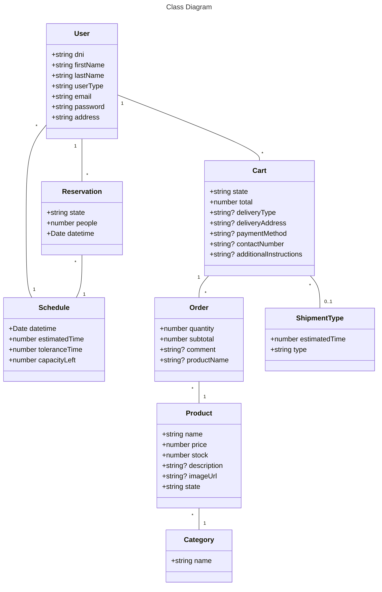

# Propuesta TP DSW

### Integrantes

| Legajo | Apellido y Nombres   |
| :----- | :------------------- |
| 48347  | Cantaberta Facundo   |
| 49641  | Battistoni Maria Paz |
| 48889  | Carballo Abril       |
| 47881  | Alfaro Bautista      |

### Repositorios

# BackEnd

- https://github.com/FacundoLpl/TP-Dsw

# FrontEnd

- https://github.com/FacundoLpl/FrontEnd-TPdsw

## Tema

### Descripción

Para el trabajo decidimos realizar un sistema relacionado con el sector gastronomico. Seria una aplicacion pensada para que la utilicen en bares, restaurantes, u otros establecimientos similares. Alguna de las opciones que permite hacer serian: hacer reservas, //utilizar distintos perfiles para cada mozo//, indicar metodos de pago, //realizar el pago mediante la aplicacion//, llevar registro de pedidos y turnos disponibles, //aceptar opiniones//, entre otras cosas.
El sitio estará diseñado para admitir diferentes niveles de usuarios, entre ellos cliente, mozo y administrador.

### Modelo

## Alcance Funcional

Aprobación Directa
|Req|Detalle|
|:-|:-|
|CRUD simple|1. CRUD de Tipos de Envio (ShipmentType) 2. CRUD de Usuarios (User) 3. Crud de Categorias de Producto (Category)|
|CRUD dependiente|1.CRUD Pedidos (Order) 2. CRUD de Carritos (Cart) 3. CRUD de Productos (Product) 4. CRUD de Reservas (Reservation)|
|Listado + Detalle|1. Listado de productos por categoría con filtros: nombre, categoría y precio. Incluye descripción, imagen, precio, stock.|
|CUU/Epic|1.Completar un carrito con productos seleccionados. - 2.Realizar una reserva con selección de día, hora y cantidad de personas.|

### Alcance Adicional Voluntario

| Req      | Detalle       |
| :------- | :------------ |
| Listados | 1. Listado de carritos completados por el usuario, con detalle de fecha, productos, cantidades, tipo de envío, forma de pago, estado, y opción de   cancelar si está dentro del plazo.- |
| CUU/Epic | 1. Cancelar un carrito 2. Envio del carrito- 3.Moderación de reviews con la api de OpenAI |
